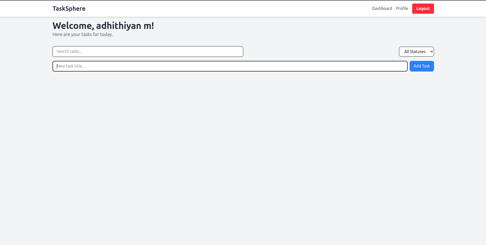

# TaskSphere - A Full-Stack Task Management Application

Welcome to TaskSphere! This is a scalable web application built with a modern tech stack, featuring user authentication, a personalized dashboard, and complete CRUD (Create, Read, Update, Delete) operations for managing tasks.

## ✨ Features

- **User Authentication**: Secure signup and login system using JWT (JSON Web Tokens).
- **Personalized Dashboard**: A dedicated space for users to manage their tasks after logging in.
- **Full CRUD for Tasks**:
  - **Create**: Add new tasks.
  - **Read**: View all tasks with search and filter capabilities.
  - **Update**: Edit task titles inline and mark tasks as complete with a checkbox.
  - **Delete**: Remove tasks that are no longer needed.
- **User Profile Management**: Users can view and update their name, email, and password.
- **Client-Side Search & Filter**: Instantly search for tasks by title or filter by completion status.

## 📸 Screenshots

Here's a sneak peek of TaskSphere in action.



*You can replace the placeholder paths below with your actual screenshots. A good practice is to create a `screenshots` directory in the root of your project to store them.*

| Login Page | Task Dashboard |
| :---: | :---: |
| !Login Page | !Task Dashboard |

| Profile Page |
| :---: |
| !Profile Page |


## � Tech Stack

| Layer      | Technology            | Notes                               |
|------------|-----------------------|-------------------------------------|
| **Frontend** | React.js (with Vite)  | A fast, component-based UI library. |
| **Styling**  | TailwindCSS           | For a clean and responsive design.  |
| **Backend**  | Node.js + Express.js  | A lightweight and scalable server.  |
| **Database** | MongoDB (with Mongoose) | A flexible NoSQL database.          |
| **Auth**     | JWT + bcrypt.js       | For secure, stateless sessions.     |

---

## 🚀 Getting Started

Follow these instructions to get a copy of the project up and running on your local machine.

### Prerequisites

- [Node.js](https://nodejs.org/) (v18.x or higher recommended)
- [MongoDB](https://www.mongodb.com/try/download/community) (or a MongoDB Atlas account)

### Installation & Setup

1.  **Clone the repository:**
    ```bash
    git clone <your-repository-url>
    cd TaskSphere
    ```

2.  **Setup the Backend:**
    - Navigate to the server directory: `cd server`
    - Install dependencies: `npm install`
    - Create a `.env` file by copying the example: `cp .env.example .env`
    - **Important**: Open the `.env` file and add your MongoDB connection string and a strong JWT secret.
    - Start the backend server: `npm run dev`
    - The server will be running on `http://localhost:5000`.

3.  **Setup the Frontend:**
    - In a new terminal, navigate to the client directory: `cd client`
    - Install dependencies: `npm install`
    - Start the frontend development server: `npm run dev`
    - The application will be available at `http://localhost:5173` (or another port if 5173 is busy).

You can now access the application in your browser and start managing your tasks!
